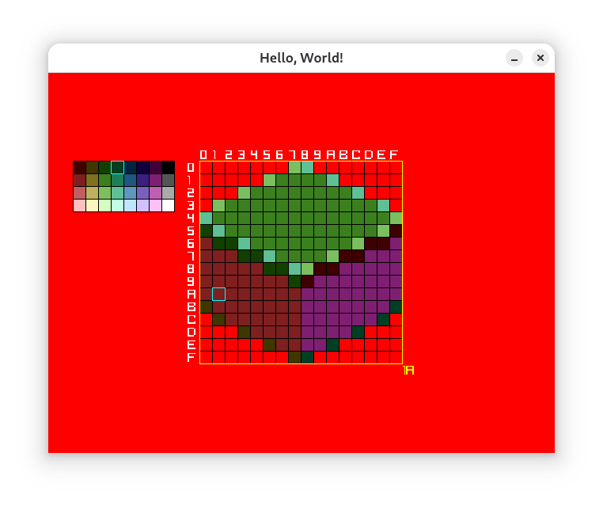

# Kuads: Pixel Art Editor

- [BUILD](./BUILD.md)

To see how to build the project, see [BUILD](./BUILD.md).

## Info & Controls

- Canvas
  - Loaded from `canvas.png`
  - Assumed size `16x16`

  - <kbd>WASD</kbd>: Move cursor
  - <kbd>QWEZ</kbd>: Move cursor diagonally
  - <kbd>Shift</kbd>: Set pixel
  - <kbd>Ctrl</kbd>: Clear pixel
- Pallete (Select Color)
  - Loaded from `pallete.png`
  - Assumed size `8x4`

  - <kbd>Arrow Keys</kbd>: Move cursor
- File
  - Auto Saves to `canvas.png` 2 seconds after inactivity

## Example

